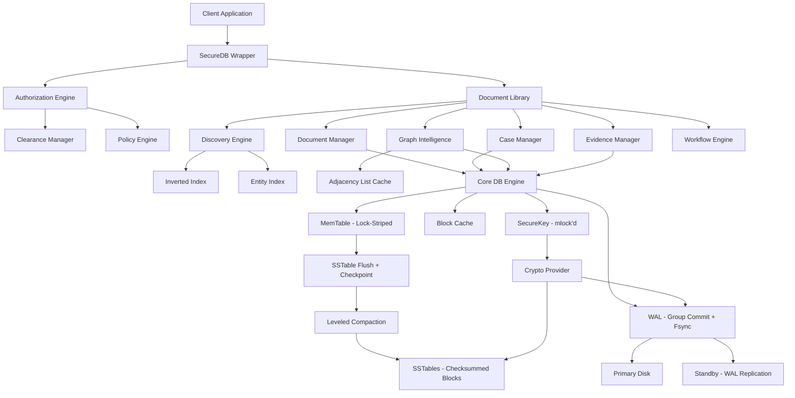

# Velocity Knowledge Platform — Security, Performance & Data Guarantee Plan

## Current State Analysis

The platform is built on an LSM-tree storage engine (`velocity.go`) with:
- WAL (write-ahead log) with encryption and fsync
- MemTable → SSTable flush with compaction
- Per-entry AES/ChaCha20 encryption
- CRC32 checksums on entries
- Bloom filters on SSTables

The doclib layer adds document management, entity graph, case management, evidence chain-of-custody, workflows, and discovery on top of this engine.

---

## Critical Gaps & Recommendations

### 1. DATA STORAGE GUARANTEE — "100% guarantee of data storage"

#### Problem Areas

**A. WAL sync-on-write defaults to `true` but can be toggled off in performance mode**
- In `performance` mode, [`velocity.go:379`](velocity.go:379) sets `syncOnWrite = false` and WAL sync interval to 200ms
- This means up to 200ms of data can be lost on crash

**Action:** Add a `DurabilityMode` config option:
- `strict` — always fsync on every write (current `balanced` mode)
- `grouped` — fsync every N ms (current `performance` mode)
- `paranoid` — fsync + double-write (WAL written to two files on different paths)

**B. Memtable flush is async and non-blocking**
- [`velocity.go:474`](velocity.go:474): `go db.flushMemTable()` — if the process crashes after WAL truncate but before SSTable write completes, data could be lost
- [`velocity.go:642`](velocity.go:642): WAL is truncated after SSTable creation, but SSTable creation is not verified with an fsync before WAL truncation

**Action:**
- Ensure SSTable file is fsynced before WAL truncation
- Add write-ahead checkpoint: write a checkpoint marker to a separate file before truncating WAL
- On recovery, verify checkpoint marker matches last SSTable

**C. No replication**
- Single-node only — disk failure = total loss

**Action (Phase 1):** Implement synchronous WAL replication to a standby node
**Action (Phase 2):** Multi-node Raft consensus for automatic failover

**D. No write verification**
- After writing to SSTable, the data is never read back to verify

**Action:** Add optional read-after-write verification for critical writes

---

### 2. SECURITY HARDENING

#### A. Memory Security

**Problem:** Sensitive data (master key, decrypted values) lives in Go heap memory, subject to GC, swapping, core dumps

**Actions:**
- Use `mlock()` on master key memory to prevent swapping
- Zero sensitive byte slices after use (already partially done in [`memory_vfs.go`](memory_vfs.go))
- Disable core dumps via `RLIMIT_CORE = 0` at startup
- Add `madvise(MADV_DONTDUMP)` for key material pages

#### B. Key Material Protection

**Problem:** [`velocity.go:69`](velocity.go:69) stores `masterKey []byte` as a struct field — accessible to any code with a `*DB` reference

**Actions:**
- Wrap master key in a `SecureKey` type that:
  - Stores key in mlock'd memory
  - Provides `Use(func(key []byte))` for controlled access
  - Zeros memory on `Destroy()`
  - Cannot be serialized or printed

#### C. Authentication Strengthening

**Problem:** JWT secret is auto-generated and ephemeral ([`velocity.go:275`](velocity.go:275)) — restarting the server invalidates all tokens

**Actions:**
- Persist JWT signing key encrypted under master key
- Support asymmetric JWT (RS256/ES256) so public key can be distributed
- Add token revocation list stored in the DB

#### D. Access Control at Storage Level

**Problem:** The underlying `DB.Get()`/`DB.Put()` have no access checks — all authorization is at the doclib layer. Any code with a `*DB` reference bypasses security.

**Actions:**
- Add a `SecureDB` wrapper that enforces authorization on every operation
- The raw `*DB` should only be accessible to the authorization engine itself
- All doclib operations should go through `SecureDB`

#### E. Encryption Key Rotation Without Downtime

**Problem:** Key rotation in [`key_rotation.go`](key_rotation.go) re-encrypts records, but during rotation, queries must handle both old and new key versions

**Actions:**
- Store key version ID with each encrypted entry
- On read, select correct key version automatically
- Background re-encryption with progress tracking
- Atomic switchover when re-encryption completes

---

### 3. PERFORMANCE & SCALABILITY

#### A. Search Performance

**Problem:** [`doclib/discovery.go:591`](doclib/discovery.go:591) `scanAllDocs()` does a full scan of all documents for every search query

**Actions:**
- Build inverted index on document metadata fields (entities, tags, classification, department)
- Index entity co-occurrence at write time, not query time
- Add B-tree secondary indexes for range queries (date ranges, amounts)
- Cache hot query results with TTL invalidation

#### B. Graph Traversal Performance

**Problem:** [`doclib/graph_intel.go`](doclib/graph_intel.go) traverses relationships by scanning key prefixes — O(n) per hop

**Actions:**
- Build adjacency list index in memory for hot entities
- Pre-compute shortest paths for frequently queried entity pairs
- Add graph query result caching with relationship-change invalidation
- Implement parallel BFS for large neighborhood queries

#### C. Concurrent Write Throughput

**Problem:** [`velocity.go:419`](velocity.go:419) `Put()` holds a write lock on the entire DB — single writer bottleneck

**Actions:**
- Implement lock-striping: partition keyspace into N shards, each with its own mutex
- Use lock-free concurrent skiplist for MemTable instead of `sync.Map`
- Batch WAL writes from multiple goroutines into a single fsync (group commit)

#### D. Read Performance Under Load

**Problem:** [`velocity.go:527`](velocity.go:527) `Get()` holds `RLock` — fine for concurrency, but SSTable binary search on every read is expensive

**Actions:**
- Implement block cache (cache decompressed SSTable blocks, not individual entries)
- Add partitioned bloom filters per SSTable level
- Implement prefix bloom filters for scan operations
- Use mmap for SSTable reads on supported platforms

#### E. Large Dataset Performance

**Problem:** Compaction holds write lock during level snapshot, and full key materialization for `Keys()` at >100K entries

**Actions:**
- Implement leveled compaction with size-tiered L0
- Use merge iterators with lazy evaluation
- Add range tombstones for efficient bulk deletes
- Implement parallel compaction (compact different levels simultaneously)

---

### 4. DATA INTEGRITY

#### A. End-to-End Checksums

**Problem:** CRC32 is fast but has known collision weakness for adversarial inputs

**Actions:**
- Use xxHash3 for performance-critical checksums (non-security)
- Use HMAC-SHA256 for integrity verification where tampering is a concern
- Add page-level checksums on SSTable blocks
- Verify checksums on every read, not just WAL replay

#### B. Corruption Detection & Recovery

**Problem:** [`velocity.go:310`](velocity.go:310) — corrupted SSTables are silently skipped with `log.Printf`

**Actions:**
- Add SSTable integrity verification on startup (scan all blocks)
- Implement automatic SSTable repair from WAL archives
- Add background scrubbing (periodic full verification of all data)
- Alert on any detected corruption

#### C. Backup Verification

**Actions:**
- After every backup, verify by restoring to a temporary location
- Store backup manifest with checksums of every SSTable included
- Test point-in-time recovery periodically (automated)

---

### 5. DOCLIB-SPECIFIC IMPROVEMENTS

#### A. Document Metadata Indexing

**Problem:** Document queries rely on prefix scans and in-memory filtering

**Actions:**
- Build composite indexes: `{classification}:{department}:{date}` → doc IDs
- Build entity mention index: `entity:{entityID}` → doc IDs
- Build tag index: `tag:{tagName}` → doc IDs
- All indexes updated atomically with document writes

#### B. Case-Entity Cross-Reference Performance

**Problem:** Cross-case intelligence requires scanning all cases to find shared entities

**Actions:**
- Maintain reverse index: `entity:{id}:cases` → list of case IDs
- Maintain reverse index: `entity:{id}:documents` → list of doc IDs
- Update indexes on case/document link operations

#### C. Evidence Integrity Chain

**Actions:**
- Hash chain: each custody event includes hash of previous event
- Merkle tree over evidence collection for batch verification
- Periodic automated integrity audit of all evidence chains

---

## Implementation Priority

### Phase 1 — Data Safety (Critical)
- [ ] Fsync SSTable before WAL truncation
- [ ] Add checkpoint marker for crash recovery
- [ ] Wrap master key in SecureKey with mlock
- [ ] Disable core dumps at startup
- [ ] Fix scanAllDocs to use inverted indexes
- [ ] Add SSTable integrity verification on startup

### Phase 2 — Performance
- [ ] Implement lock-striping for concurrent writes
- [ ] Build inverted indexes for document metadata
- [ ] Add block cache for SSTable reads
- [ ] Implement group commit for WAL
- [ ] Build entity reverse indexes for case/document lookups

### Phase 3 — Advanced Security
- [ ] SecureDB wrapper with per-operation authorization
- [ ] Asymmetric JWT with persisted keys
- [ ] Key rotation with versioned entries
- [ ] Background data scrubbing
- [ ] Backup verification

### Phase 4 — Scalability
- [ ] WAL replication to standby
- [ ] Parallel compaction
- [ ] Partitioned bloom filters
- [ ] mmap SSTable reads
- [ ] Raft consensus for multi-node

---

## Architecture Diagram

---

## Key Principle

> **For 100% data guarantee: every write must be durable before acknowledgment.**

This means:
1. WAL fsync before returning success to caller
2. SSTable fsync before WAL truncation
3. Checkpoint marker between SSTable write and WAL truncation
4. Backup verification after every backup
5. Periodic integrity scrubbing of all data
